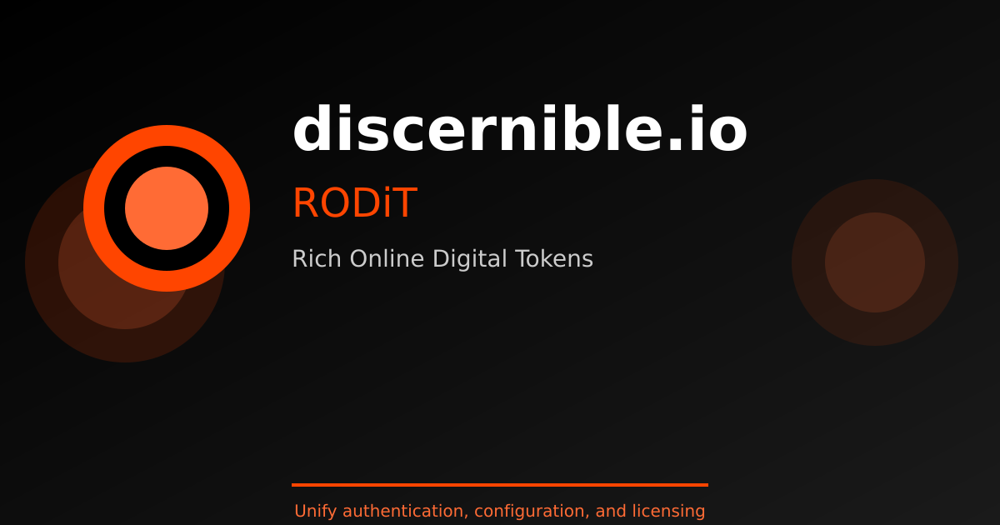

# homepage-discernible-io



A modern, responsive static homepage for [IdentyClaw](https://www.discernible.io) and Discernible.io — built with HTML, CSS, and JavaScript.

## Site content

The live site at [discernible.io](https://www.discernible.io) includes:

- **Use Cases** — why Passports matter: many-to-many scale, facial ID, sovereign ownership, multi-channel HOLA
- **How to Enroll** — templates for [OpenClaw](https://github.com/discernible-io/openclaw-agents), [Hermes](https://github.com/discernible-io/hermes-agents), and [IronClaw](https://github.com/discernible-io/ironclaw-agents/tree/feat/identyclaw-passport), plus custom/plugin paths
- **Developers** — full IdentyClaw open-source stack (templates, plugins, [rodit-sdk](https://github.com/discernible-io/rodit-sdk), [api-test-scaffold](https://github.com/discernible-io/api-test-scaffold), [gennearaccount](https://github.com/discernible-io/gennearaccount), [api-scaffold-federated-rodit-auth](https://github.com/discernible-io/api-scaffold-federated-rodit-auth))
- **Last Cradle** — [Synthetics' Last Cradle](https://lastcradle.io/about) overview with links to join, watch, prizes, and the game API
- **Powered by RODiT** — protocol layer with link to the [rodit-sdk](https://github.com/discernible-io/rodit-sdk) monorepo
- **Contact** — newsletter, concierge, GitHub org, API docs

Source files live under `public/` (`index.html`, `developers.html`, `lastcradle.html`, `styles.css`, `script.js`).

## 🚀 Features

- **Modern Design**: Clean design with brand colors (black, white, and orange #FF4500)
- **Fully Responsive**: Works seamlessly on desktop, tablet, and mobile devices
- **Interactive Elements**: Smooth scrolling, form handling, and scroll animations
- **Performance Optimized**: Lightweight static site with no build dependencies
- **Auto-Deployment**: Automatic deployment to GitHub Pages via GitHub Actions

## 📁 Project Structure

```
homepage-discernible-io/
├── .github/
│ └── workflows/
│ └── deploy.yml # GitHub Actions deployment workflow
├── public/
│ ├── index.html # Main HTML file
│ ├── styles.css # CSS styling
│ ├── script.js # JavaScript functionality
│ ├── logo.png # Logo image
│ ├── banner.png # Banner image (1200x630px)
│ └── banner.svg # Banner source (SVG)
├── certs/ # SSL/TLS certificate management (legacy)
│ ├── README.md # Complete certificate setup guide
│ ├── setup-all.sh # Automated setup script
│ └── ... # Management scripts and configs
├── generate-banner.js # Script to generate banner.png from banner.svg
├── package.json # Node.js package configuration
└── README.md # This file
```

## 🌐 Deployment on GitHub Pages

This site is configured to automatically deploy to GitHub Pages using GitHub Actions.

### Automatic Deployment

Every push to the `main` branch automatically triggers deployment via the GitHub Actions workflow (`.github/workflows/deploy.yml`).

### Initial Setup

1. Go to your repository on GitHub: `https://github.com/discernible-io/homepage-discernible-io`
2. Navigate to **Settings** → **Pages**
3. Under **Source**, select **GitHub Actions**
4. Push your changes to the `main` branch
5. The workflow will automatically deploy your site

Your site will be available at: `https://discernible-io.github.io/homepage-discernible-io/`

### Custom Domain (Optional)

To use a custom domain like `discernible.io`:

1. In your repository, go to **Settings** → **Pages**
2. Under **Custom domain**, enter `discernible.io`
3. Add the following DNS records at your domain registrar:
 - `A` record: `185.199.108.153`
 - `A` record: `185.199.109.153`
 - `A` record: `185.199.110.153`
 - `A` record: `185.199.111.153`
 - `CNAME` record for `www`: `discernible-io.github.io`
4. Wait for DNS propagation (can take up to 24 hours)
5. Enable **Enforce HTTPS** in GitHub Pages settings

## 🏃 Running Locally

To run this site locally:

```bash
# Install http-server globally (one-time setup)
npm install -g http-server

# Run the development server
npm start
```

Then open your browser to `http://localhost:8080`

Alternatively, you can use any static file server:

```bash
# Using Python 3
cd public
python3 -m http.server 8080

# Using PHP
cd public
php -S localhost:8080
```

## 🎨 Customization

- **Colors**: Edit CSS variables in `public/styles.css` under `:root`
 - Primary: `#FF4500` (Orange from logo)
 - Secondary: `#000000` (Black from logo)
 - Accent: `#FF6B35` (Lighter orange)
- **Content**: Modify text and structure in `public/index.html`
- **Functionality**: Add or modify JavaScript in `public/script.js`

## 🔄 Deployment Workflow

### GitHub Pages (Current)
1. Make changes to files in the `public/` directory
2. Commit your changes: `git add . && git commit -m "Your message"`
3. Push to GitHub: `git push origin main`
4. GitHub Actions automatically deploys to GitHub Pages
5. Site is live at `https://discernible-io.github.io/homepage-discernible-io/`

### Legacy Apache Deployment
The `deploy.sh` script and Apache configuration are kept for reference but are no longer the primary deployment method.

## 🔒 SSL/TLS Certificate Setup (Apache2)

For production deployment with SSL/TLS certificates using Apache2 and Let's Encrypt:

### Quick Setup
```bash
cd certs
./setup-all.sh
```

This will:
- ✅ Configure Apache2 web server
- ✅ Obtain free SSL certificates from Let's Encrypt
- ✅ Set up automatic certificate renewal
- ✅ Configure security headers (HSTS, CSP, etc.)
- ✅ Enable HTTPS with automatic HTTP redirect
- ✅ Set up monitoring and backups

### Documentation
- **[Complete Guide](certs/README.md)** - Detailed setup instructions
- **[Quick Start](certs/QUICKSTART.md)** - Quick reference commands
- **[DNS Setup](certs/DNS-SETUP.md)** - DNS configuration guide
- **[Checklist](certs/CHECKLIST.md)** - Step-by-step verification
- **[Summary](certs/SUMMARY.md)** - Package overview

### Prerequisites
- Ubuntu/Debian server with sudo access
- DNS records pointing to your server:
 - `discernible.io` → your_server_ip
 - `www.discernible.io` → your_server_ip
- Ports 80 and 443 open

### Features
- 🔐 Free SSL certificates from Let's Encrypt
- 🤖 Automated certificate renewal
- 📊 Certificate expiry monitoring
- 💾 Automated weekly backups
- 🔒 Security headers (A+ rating)
- 📧 Email notifications
- 🧪 Comprehensive testing tools

## 📝 License

MIT